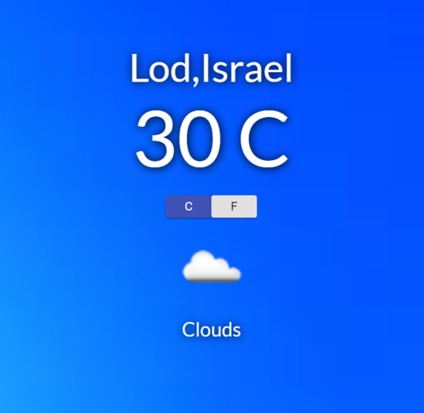

# WeatherApp

##### A Simple React Weather App

#### 


### How To Use:
  Step 1:
```sh
git clone https://github.com/lina789/WeatherApp.git
```
  Step 2:
```sh
npm install
```
  Step 3:
```sh
npm start
```
